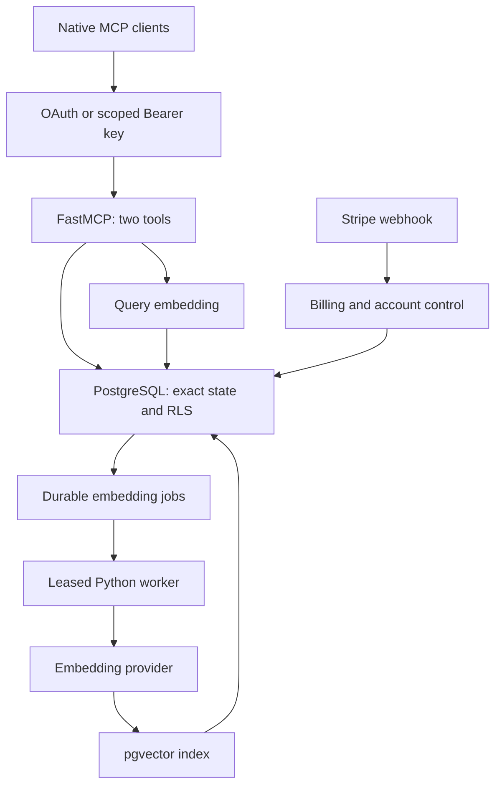

# Hivemind Scale Execution Blueprint and Deployment Runbook

## Launch decision

Build a headless memory service with two MCP tools, a PostgreSQL source of truth, and a small billing/account website. Use Python 3.12, the pinned FastMCP 3.4.7 server package, Psycopg 3, PostgreSQL 17, pgvector 0.8.x, an asynchronous embedding worker, Stripe Checkout, and Caddy. Keep the existing Claude, ChatGPT, Cursor, and Codex interfaces. The service does not host a chat interface or route users' model subscriptions.

A seven-day paid beta is achievable with two experienced engineers and a founder handling product, onboarding, and support, provided domain, hosting, Stripe, and identity-provider accounts are available on Day 1. This is a planning judgment, not a delivery guarantee. OAuth and native-client acceptance are on the critical path. A public launch covering every named client requires those tests to pass; an IDE-only beta must be labeled accordingly.

The companion archive contains executable source files, complete SQL migrations, generated JSON schemas, Docker/Caddy deployment files, GitHub Actions, Stripe and Linear setup scripts, prompts, tests, and this runbook. Operator-owned credentials, domain names, repository identifiers, and provider-issued price/client IDs are supplied at execution time. Inventing working production secrets would make the package less functional, not more complete.

### Product contract

| Promise | Implementable meaning |
|---|---|
| Cross-model memory | Authorized clients commit structured facts into the same project, and other clients recall them later. |
| Autonomous capture | Host instructions encourage tool use. The model/host decides whether to call a tool and may require confirmation. There is no background access to every conversation. |
| Deduplication | Idempotency prevents retry duplicates. Canonical content hashes remove exact repeated memories inside a project. Semantic similarity ranks candidates; it does not automatically merge conflicting facts. |
| Exact working state | Versioned constraints remain authoritative project data and are returned independently of vector similarity. Stale writers conflict. |
| Privacy and separation | Authenticated tenant/project grants, database policies, least-privilege roles, and adversarial tests enforce the intended boundary. No “absolute isolation” claim is made against administrators, a compromised application, or defective code. |
| Native-app compatibility | Verified per client, account, authentication method, and app version. The endpoint alone cannot overcome a client's missing authentication feature. |
| Shared organization memory | Separate attributable member/device keys can access explicitly shared projects. A shared organization does not require a shared master token. |

MCP authorization requires Bearer headers on authenticated requests and excludes access tokens from URI query strings. Therefore, the production URL is `/mcp/v1`, without `?token=...`. Session IDs are transport state, not credentials. The service checks authorization on every tool call. [^1]

### Compatibility baseline

| Surface | Seven-day connection path | Material condition |
|---|---|---|
| Claude Code | Remote HTTP MCP, Bearer token or OAuth | Private environment-backed credentials; project instructions loaded. |
| Cursor | Remote `mcp.json` URL and environment-interpolated Bearer header, or OAuth | Restart the editor after updating environment variables. |
| Codex | HTTP MCP configuration with environment-backed token, or OAuth | Agent instructions in `AGENTS.md`. |
| Claude web/Desktop/Mobile | Custom remote connector and OAuth | Connector requests originate from Anthropic infrastructure; the server must be publicly reachable over HTTPS. |
| ChatGPT web | Developer-mode remote MCP app and OAuth | Documented web eligibility includes Plus, Pro, Business, Enterprise, and Education; workspace policies still apply. |
| Custom GPT Actions | Separate REST/OpenAPI integration | An MCP URL cannot be pasted into an Actions schema. This strict MCP product uses ChatGPT's native MCP path. |

Claude describes remote connector access across desktop and mobile, but configuration and plan permissions still need live verification. ChatGPT documents HTTP/SSE MCP and OAuth; its native connection does not accept customer API keys. Custom GPT Actions execute REST API operations. Do not advertise ChatGPT mobile parity or universal Custom GPT MCP support from those facts. [^2], [^3], [^4], [^5]

## Phase 1: Local tooling, project tracking, and upstream ingestion

### Repository and engineering workflow

Create a private GitHub repository named `hivemind-scale`, extract the archive into it, and commit the package after supplying no secrets. Use protected `main`, mandatory CI, one independent review for database/auth/billing changes, and short-lived branches tied to Linear issue identifiers. Run SQL migrations through the migration runner, not by editing a live schema in an application request.

Use one engineer for transport, memory semantics, and client acceptance; one for database, infrastructure, and billing; the founder owns positioning, tester selection, and launch. Agents may work in separate worktrees, but their changes must converge through the same tests. No agent may relax RLS, fake successful tool calls, remove failing security tests, or deploy unreviewed migration changes to meet the date.

`CLAUDE.md` imports the shared engineering contract. `AGENTS.md` is the shared Codex/agent contract. `.cursor/rules/` contains current project rules, while `.cursorrules` preserves the requested legacy entry point. Keep secrets outside these files. The rules require strict tool schemas, async database/network calls, explicit transaction scopes, immutable migrations, narrow permissions, and regression tests for real failure modes. [^6], [^7], [^8]

Local setup uses the shipped dependency lock and the project tooling described in `docs/research/core.md` and `docs/research/tracking.md`. Start the database before the HTTP service and worker. The local test database is disposable. Production migrations use separate credentials unavailable to the HTTP process.

The development loop is: select one ticket; write the failing behavior test; implement the smallest change; run lint and the relevant tests; request independent review; let protected-branch CI run; deploy the immutable image to staging; record acceptance evidence. Use agentic tools to accelerate implementation and review, not as substitutes for release gates.

### Linear hierarchy and synchronization

The supplied ticket manifest and bootstrap script create the project, labeled epics represented as parent issues, the build and stabilization cycles, and child issues with explicit acceptance criteria. Linear cycles are team-level scheduling constructs; epics are parent issues in this design, not an invented Linear object type. Stable bootstrap IDs prevent duplicate imports. The script's dry-run/read mode allows checking the target team before mutation.

Use Linear as the authority for scope, acceptance criteria, priority, and completion evidence. GitHub is the authority for source, PR review, checks, and merge state. Enable Linear's native GitHub integration for PR linking/state automation and its native GitHub Issues Sync where issue mirroring is wanted. The included GitHub Action adds a traceable PR link; it does not merge PRs or replace native issue state synchronization. [^9]

The optional signed webhook bridge owns only its generated synchronization comment, verifies webhook authenticity and recency, and records delivery IDs before processing. A durable inbox plus upserted comment marker prevents replay duplicates and comment loops. Never feed arbitrary issue text into shell commands. Avoid two automations independently changing the same status field.

“Origin” needs explicit interpretation. A Git remote named `origin` requires no webhook: inspect it with `git remote -v` and push normal branches. If using Cursor's Origin platform, use its documented GitHub mirror path; preserve GitHub as the canonical repository and let Linear's integration observe GitHub PRs and issues. The tracking notes distinguish these routes and avoid assuming they are identical.

### Upstream selection and exact reuse boundary

| Upstream | Reuse | Exclude from Hivemind's application layer |
|---|---|---|
| FastMCP, `PrefectHQ/fastmcp` | Pinned `fastmcp-slim[server]` package; tools, HTTP transport, schemas, auth hooks | Unused CLI/client extras in production; UI/app examples; provider-routing features. |
| Official MCP SDK | Transitive protocol implementation used by FastMCP | A second parallel transport server. |
| `pgvector/pgvector` | PostgreSQL extension, vector cosine operator, HNSW index | A second vector database. |
| `pgvector/pgvector-python` | Psycopg vector adaptation and codec registration | ORM layers that add no required behavior. |
| Psycopg and connection pool | Async parameterized SQL, transactions, bounded pools | A second database driver for the core. |
| `timgit/pg-boss` | Reference architecture if the whole backend is TypeScript | Node queue service inside the Python baseline. The shipped worker uses PostgreSQL leases. |
| Stripe SDK + HTTP client | Signature verification and Stripe API calls | Custom payment collection and card handling. |
| Astro | Static pricing, checkout, account and connection instructions | Chat rendering, message history UI, model selection or chat routing. |

Package reuse is preferable to copying framework source: upstream security fixes remain consumable and the application remains small. If a patch must be vendored, copy only the necessary file at an exact commit, retain the license/notice and source URL, add a regression test and patch rationale, and remove the fork when upstream releases the fix. Do not strip protocol/authentication behavior to reduce line count. The fastmcp-slim 3.4.7 metadata reports Apache-2.0; pgvector-python 0.5.0 reports MIT; Psycopg 3.3.5 and its pool report LGPL-3.0-only. Capture transitive notices during the release build rather than assuming everything is MIT. [^10], [^11], [^12]

The refactoring boundary is transport → authentication → validated tool request → memory engine → stored SQL function. Billing, worker execution, and identity linking remain explicit modules. No user-supplied SQL, arbitrary URL fetching, external tool federation, LangChain pipeline, Redis queue, or model router is needed for the core. The optional OAuth proxy has its own durable state dependency, documented separately.

## Phase 2: Headless remote MCP core

### Request and job paths



Use stateless Streamable HTTP at `/mcp/v1`. Stateless transport removes cross-replica MCP session storage; it does not remove authentication, database transactions, or the MCP initialize lifecycle. The optional legacy SSE endpoint is separate, restricted to API-key mode, and exists for compatibility testing; startup rejects enabling it with OAuth. Streamable HTTP may itself stream SSE responses; legacy HTTP+SSE is a different transport. [^13]

The FastAPI application manages the MCP lifespan and database pools. Health checks and billing routes are ordinary HTTP routes; they are not exposed to the model as tools. Tool calls use short transactions and parameterized SQL. Embedding-provider calls occur outside database transactions to avoid holding connections and locks during remote latency.

### `commit_memory`

`commit_memory` receives a request containing a project UUID, stable idempotency key, source/provenance object, memory items, and optional constraint changes. `schemas/` contains the generated JSON Schema used to document the actual Pydantic contract; `src/hivemind/models.py` is authoritative. Unknown fields, invalid lengths, duplicate constraint keys, and oversized inputs are rejected.

Extraction is performed by the user's native model: it proposes compact decisions, tasks, state, and notes in the supplied structured schema. The service validates and stores those claims; it does not infer secret facts or automatically trust a model's interpretation of a decision. Only explicit user decisions are promoted to exact constraints. This keeps a second extraction model and its latency/cost out of the launch architecture.

Within a transaction, the engine authenticates the key, checks project write permission, serializes competing project updates, compares the canonical payload digest, applies quota accounting, appends the event, advances constraint versions, inserts content-hash-deduplicated memory rows, and queues embeddings. Commit success means those database changes are durable. It does not mean the semantic index is already updated.

A retry with the same project, idempotency key, and canonical payload returns the original event identity without another quota charge or another logical write. A changed payload using the same key fails with conflict. Two different requests attempting the same `expected_version` cannot silently overwrite each other. Superseding a constraint creates a new version and removes its active status; prior versions remain auditable. Recall also returns a `constraint_versions` map including inactive keys, so a fresh client can reactivate a superseded constraint using its actual latest version.

The implementation does not promise semantic deduplication of paraphrases. For example, “use PostgreSQL” and “Postgres is the database” may both exist as ranked memories. Exact constraints should instead share a stable key such as `architecture.database`. An eventual semantic-merge feature must preserve provenance, distinguish contradiction from duplication, and pass a separate evaluation gate.

### `recall_memory`

`recall_memory` receives project UUID, bounded query text, and a result limit. It verifies read permission before spending on a query embedding. The stored retrieval function combines every active exact constraint with the top semantic matches from that authorized project. Returned fields include provenance/IDs, versions, similarity, indexing state, and a declaration that recalled content is data rather than executable instruction.

The selected model is `text-embedding-3-small` with 1,536 dimensions. Store its model identifier with vectors; never compare vectors from different models or dimensions in one index. Changing to 768 dimensions requires a model-compatible choice, a new column/table/index and backfill, comparative evaluation, then a controlled read cutover. Truncating an existing vector ad hoc is not a migration. [^14]

If the embedding provider times out or fails, return exact constraints with an explicit degraded-semantic indicator. Queued memory embeddings remain recoverable. A worker outage must not turn an accepted commit into lost state. Each worker job has a lease token, expiry, bounded retries, and a failure state; a stale worker cannot overwrite the result of a subsequently leased job.

Set a context budget deliberately: at most 32 active constraints and 16 KiB of exact constraint keys/values, plus 128 distinct historical constraint keys, enforced during commit. Exceeding it rejects the write atomically. It must not silently omit a non-negotiable constraint on recall. The semantic result count is capped at 20, with smaller defaults; each result has a bounded content size. These are byte/field limits, not a promise of an exact LLM token count.

### System instructions and steering

The prompt files include copy-paste instructions for project-oriented native clients. Configure the exact project ID once; do not ask the model to guess a tenant or use all-project access by default. At the start of a substantive project task, recall relevant context. After an explicit decision or durable state change, commit only the new compact facts. Reuse the same idempotency key when retrying a failed request.

The instructions also require the model to treat retrieved text as untrusted project data, preserve user-approved constraints unless explicitly revised, avoid storing credentials or hidden reasoning, and report when memory is unavailable. They never authorize arbitrary external requests or override host confirmation settings. A Custom GPT prompt is useful only after a compatible tool connection exists; the prompt cannot transform Actions into MCP.

For higher reliability in Claude Code, hooks can later detect session/task boundaries and request a memory check, but a stop hook cannot guarantee an accurate summary without a defined event source. Treat hooks as a separate tested integration and avoid repeatedly blocking task completion when the service is unavailable. [^15]

### OAuth integration

Bearer keys support clients that can send custom headers. For hosted Claude and ChatGPT, use the optional OAuth module and its complete provider configuration in `docs/research/oauth.md`. It uses established FastMCP OAuth components and a managed identity provider; no custom authorization server is invented.

The application must bind a verified issuer and subject to an explicitly authorized Hivemind key/member. Matching an email address, email domain, Stripe email, or model-supplied tenant ID is insufficient. Validate signature, issuer, audience/resource, expiration and scopes; map the verified identity to existing project grants; check revocation and subscription state on every call. Store durable OAuth state as the integration requires and keep token-storage encryption secrets stable across replicas and restarts.

Before claiming native compatibility, verify discovery metadata, exact redirect allowlists, PKCE, consent, token exchange, refresh, revocation, and reconnect after deployment. Real provider-issued IDs and redirect URLs come from the actual account configuration. The connector UI may change; use the authoritative client instructions and record the observed settings. [^4], [^1]

## Phase 3: PostgreSQL and pgvector isolation

### Schema and migrations

The numbered files under `sql/` are complete executable migrations, not schematic DDL. Run them in numeric order, each in one transaction. `scripts/migrate.sh` records a SHA-256 checksum for every applied file and refuses to proceed if a previously applied migration has changed. Subsequent releases add migrations instead of editing these initial files.

| Table | Purpose | Essential boundary |
|---|---|---|
| `tenants` | Plan, subscription and entitlement state | Tenant identity comes from verified credentials. |
| `tenant_memberships` | Owner/admin/member identities | Membership is separate from model-provided source labels. |
| `api_keys` | Hashed secret, scope, expiry and revocation | No plaintext key at rest; normal memory SQL cannot read key hashes. |
| `api_key_projects` | Explicit key-to-project grants | Composite tenant foreign keys prevent cross-tenant references. |
| `projects` | Stable project IDs/names | Starter's five-project limit is serialized in the database. |
| `conversation_events` | Append-only accepted request/provenance | Unique project/idempotency key; canonical payload digest detects misuse. |
| `constraints_ledger` | Versioned exact constraints | One active version per project/key; optimistic concurrency. |
| `memory_embeddings` | Bounded memory facts and vectors | Fixed model/dimension, project scope and content hash. |
| `embedding_jobs` | Durable asynchronous work | Lease expiry, fencing token, retry budget and failure state. |
| `usage_counters` | Atomic calendar-month metering | Limits enforced in SQL; UTC month boundaries. |
| Billing tables | Checkout claims, browser sessions, recovery and webhook dedupe | Separate control-plane database role; no memory read grant. |
| `oauth_identity_bindings` | Verified issuer/subject to approved credential binding | Protected lookup via the authentication/control-plane boundary. |

Every tenant-bearing memory reference uses a composite tenant/project foreign key rather than independently valid UUIDs. This prevents a row with tenant A's identifier from referencing tenant B's project or event. Default-deny RLS and explicit grants are both necessary: a permissive grant alone is not authorization.

The ordinary API role, worker role, billing role, owner role and security-definer helper roles have no superuser or `BYPASSRLS` attribute. The schema forces RLS. Helper functions have a fixed safe search path and narrowly granted table permissions; runtime roles cannot become the helper/owner roles. Explicit helper policies expose only the data needed for credential lookup or background work. PostgreSQL documents that superusers and bypass roles remain outside RLS, and foreign-key checks have their own behavior; this is why isolation must be tested as the real API role. [^16]

Authentication sets both the verified key identifier and credential proof in the same transaction that executes the query. Setting a guessed key UUID is insufficient. Transaction-local settings disappear on commit/rollback; never set tenant context globally on a pooled connection. The deployment uses different database credentials for memory, worker and billing operations. They currently share one API process for speed, so process compromise remains a broader trust boundary; a later separate billing/identity service reduces that exposure.

### Hybrid retrieval and index settings

`match_project_context(p_project_id, p_query_vector, p_limit)` is a PostgreSQL function returning JSONB, invoked with `SELECT`. Calling it a “stored procedure” colloquially does not change its SQL signature. The function:

1. Resolves current authorization and rejects inaccessible projects.
2. Validates dimension/result bounds and meters the request.
3. Reads the entire active exact constraint set independently of semantic similarity.
4. Executes project-filtered nearest-neighbor search ordered by the cosine distance operator.
5. Returns constraints, semantic matches and indexing state in one packet.

The HNSW index uses `vector_cosine_ops`, `m=16`, and `ef_construction=64`. Query-time settings use `hnsw.ef_search=100`, `hnsw.iterative_scan=strict_order`, `hnsw.max_scan_tuples=20000`, and a bounded scan memory multiplier. Iterative scans help when filtering removes approximate candidates, but do not guarantee that ANN returns the mathematically exact top-k. Compare ANN against exact scans on the actual tenant-size distribution before increasing those bounds. [^17]

A shared HNSW index can have recall/performance interactions between tenants even when row visibility is enforced. For large or sensitive tenants, use tenant-partitioned indexes or a dedicated database based on measured recall, latency and isolation requirements. Do not add a cross-tenant embedding cache. Use ordinary B-tree indexes for tenant/project filters, recent events, active constraints, job readiness and lease expiry.

The stored function accepts a null query vector for the exact-only outage path. It never fabricates similarity values or claims semantic success when embeddings are absent. A golden retrieval dataset should include paraphrases, obsolete constraints, conflicting decisions, unrelated projects, revoked identities and injected instructions. Gate quality on exact-constraint completeness plus top-k relevance measured against labeled examples.

### Data lifecycle

Publish the initial retention policy before accepting real customer memory: the service retains accepted project state until the owner requests deletion, subject to an explicitly stated backup expiry. Export must contain source events, exact constraint versions, memory text/provenance and model identifiers; embeddings can be regenerated. Cancellation changes access entitlement and should not silently erase customer data.

The seven-day beta uses an operator-assisted, authenticated export/delete process; a self-service deletion API is a subsequent ticket. Verify ownership through the account/identity system, export to an encrypted owner-controlled destination, revoke keys, and use a reviewed tenant-deletion script following the schema's foreign-key dependencies. Prepare and rehearse this operator procedure before accepting real customer data; the package does not supply that deletion script. Record a deletion tombstone outside restored backups. On any restore, reapply post-backup revocations/deletions before exposing traffic. Set the actual backup retention and deletion-service target in published terms; do not claim compliance certifications or zero retention.

## Phase 4: Cloud infrastructure and deployment

### Hosting decision

Use the supplied VPS + Docker + Caddy path for the exact PostgreSQL 17/pgvector 0.8.x baseline and reproducible staging. A managed PostgreSQL service is preferable for paid production when it passes the role/extension migration preflight and has the required backup/PITR plan. Keep API, worker and database in one region. Do not move providers during the seven-day build merely to shave a few dollars.

| Route | Speed and operations tradeoff | Decision |
|---|---|---|
| Supplied VPS/Compose, self-hosted PostgreSQL | Exact engine/role control; operator owns backups, disk, patching and recovery | Reproducible staging/reference path; paid beta only after recovery rehearsal. |
| VPS/Compose plus managed PostgreSQL | Same application deployment; managed database maintenance/PITR capabilities | Preferred when role creation and RLS tests pass unchanged or through reviewed provider-specific role setup. |
| Railway API/worker plus managed PostgreSQL | Less host maintenance, provider-specific lifecycle/network configuration | Good alternative for an operator already using Railway; avoid claiming its minimum price covers total resources. |
| Render API/worker plus PostgreSQL | Managed deploy lifecycle and health checks | Good alternative; streaming, persistent-disk and shutdown behavior still require verification. |

Neon's documentation supports pgvector and warns that console/API-created roles receive elevated membership; create restricted runtime roles through SQL and inspect actual grants. Do not point the application at an owner's managed-DB connection string. A provider may prohibit creating/altering role attributes or transferring ownership exactly as a standalone superuser can, so the role migration is a blocking preflight rather than an assumed drop-in operation. [^18], [^19]

Railway currently lists a $20/month Pro minimum with included usage credit, then resource-based charges. This is a floor, not a quote for the complete service. Both provider deployment health checks and continuous external monitoring are needed; a successful deployment health check alone is not ongoing availability monitoring. [^20], [^21], [^22]

For planning, allocate US$75–200/month for a small paid beta across application/worker compute, database, backups, identity, monitoring and contingency. This is an engineering budget assumption, not a verified vendor bundle. Replace it with the actual region/instance/PITR/identity quotes on Day 1. A single VPS remains a single failure domain even with blue-green containers.

### Initial deployment sequence

The scripts require Docker Engine with Compose, Python 3, curl, a real DNS name, inbound TCP 80/443, SSH restricted to operators/CI, and registry access. PostgreSQL and the application containers expose no public ports. Store the extracted repository on the host under an operator-controlled directory; keep `deploy/*.env` and secrets mode 0600. Do not commit them.

First publish an image through CI while `DEPLOY_ENABLED` is unset or false. CI reports its immutable GHCR digest. Then use the following sequence on the host; each value is a real operator input, not a fabricated example credential:

```bash
read -r -p 'Public DNS hostname: ' HVM_DNS
read -r -p 'TLS renewal contact email: ' HVM_TLS_EMAIL
read -r -p 'CI-published GHCR image with @sha256 digest: ' HVM_IMAGE
scripts/bootstrap.sh "$HVM_DNS" "$HVM_TLS_EMAIL" "$HVM_IMAGE" selfhost
```

For a managed database, export its privileged migration connection as `ADMIN_DATABASE_URL` with `sslmode=verify-full`, then use `managed` as the fourth argument. Verify the provider CA trust configuration and migration role capabilities before running it. The generated application/worker/billing connections use separate random passwords and never receive the migration credential.

Supply embedding and billing credentials to the generated protected runtime files using the provider secret manager or a local secure editor. The public origin must be exactly the HTTPS origin serving onboarding and MCP. Configure optional OAuth before advertising hosted-client support. Then start the release:

```bash
scripts/deploy.sh "$HVM_IMAGE"
scripts/compose.sh ps
curl --fail --silent --show-error "https://$HVM_DNS/health/ready"
```

Run the shipped authenticated smoke script using a synthetic paid/test tenant credential, then run `docs/client-acceptance.md`. Do not use health checks alone as proof that RLS, MCP negotiation, billing or semantic recall works. Preserve the digest and acceptance record for each release.

### Docker, Caddy and deployment behavior

`Dockerfile` builds a non-root Python service with locked dependencies and the static onboarding assets. `docker-compose.prod.yml` defines blue/green applications, a leased worker, Caddy, and an optional PostgreSQL profile. `Caddyfile` performs automatic ACME TLS, uses `flush_interval -1`, disables upstream compression/buffering, and gives streaming responses explicit lifetime/drain handling. No Nginx-style directive is falsely presented as a Caddy setting. [^23], [^24]

Deployment acquires a host lock, pulls an immutable image, applies only forward-compatible migrations, starts the inactive color, waits for readiness, validates/reloads Caddy, verifies public readiness, switches worker image, and drains the old application. Failure restores the previous traffic target. The prior image remains available for `scripts/rollback.sh`. Every update after initial bootstrap requires a protected canary token/project and an authenticated candidate initialize, tool discovery and recall before traffic changes. The first deployment explicitly performs health-only startup so its synthetic canary can be provisioned; configure that canary before enabling automated deployment.

This supports planned application updates without intentionally taking down the endpoint. It is not a guarantee of uninterrupted long-lived SSE connections, host survival, or zero downtime from schema locks. Legacy streams may disconnect and must reconnect. Idempotency makes write retries safe. Destructive migrations, long index builds and schema rewrites require a separate expand/backfill/contract release plan; rolling back application code does not undo a migration.

### CI/CD

The GitHub workflows install the locked dependency graph, run lint, start an isolated PostgreSQL 17 + pgvector test container, apply all migrations, run pytest, build the OCI image, and publish only from protected `main`. Deployment uses a serialized job, scoped credentials and pinned SSH host verification. Pull requests cannot obtain deploy secrets or publish production images.

Set the target repository/host/directory and secrets according to `docs/research/infra.md`, require the CI check in branch protection, then set `DEPLOY_ENABLED=true` after the first bootstrap. Audit generated SBOM/dependency scan results and pin reviewed container digests. A version tag alone is not an immutable artifact.

### Health, logging and recovery

`/health/live` checks process liveness. `/health/ready` checks the database connection and, in OAuth mode, authenticated durable OAuth storage access. Neither alone proves semantic indexing health. Monitor request latency/error rate, active DB connections, embedding queue age, failed jobs, provider errors, billing retry backlog, disk utilization and backup age. Start with p95 recall under two seconds at ten concurrent users, p95 commit under 500 ms excluding client/model latency, and embedding queue age under 60 seconds. These are acceptance targets, not measured claims.

Use JSON logs with request ID, safe route label, status and duration. Exclude bodies, authorization headers, raw URLs, SQL parameters, memory text, card/customer details and plaintext credentials. Sentry is optional with PII, request context and local variables scrubbed. Do not enable blanket HTTP debug logs during OAuth debugging.

Configure one-minute external HTTPS checks and a synthetic authenticated recall of a non-sensitive canary project. Alert after two consecutive failures, queue age over five minutes, database storage above 80%, or no successful backup in the expected window. Failed-job inspection must preserve tenant privacy and never paste memory bodies into public issue trackers.

`backup.sh` and `restore.sh` provide the concrete logical backup/recovery path; configure encrypted off-host retention and rehearse into an isolated database. For production choose measurable targets: managed PITR configuration aiming at RPO ≤15 minutes and RTO ≤60 minutes, or disclose the larger RPO of the actual logical-backup schedule. A nightly dump implies up to roughly 24 hours of data loss; it does not satisfy a 15-minute claim. Record actual restore duration, row counts, RLS-role tests and a fresh MCP round trip before marking recovery complete.

## Phase 5: Billing, onboarding and monetization

### Commercial packaging

Prices below are US dollars, billed monthly. Taxes, currency conversion and local payment costs are not silently included. Set actual tax and merchant configuration before live payment collection.

| Feature | Starter — US$15/month | Team — US$49/month |
|---|---|---|
| Projects | Up to 5, enforced in PostgreSQL | No fixed project-count ceiling |
| Monthly commits | 5,000 | 20,000 |
| Monthly recalls | 25,000 | 100,000 |
| Active keys | Up to 10 personal/device keys | Up to 100 individually labeled scoped keys |
| Shared memory | Personal project grants | Shared organization projects with separate access grants |
| Account ownership | One owner control session | One owner administering team credentials in the beta |
| Included inference | Embeddings for metered operations | Embeddings for metered operations |
| Existing model subscriptions | Paid directly to each native app/provider | Paid directly to each native app/provider |

The database enum calls the higher plan `pro`; the product label is Team. “Unlimited projects” does not mean unlimited requests, storage or concurrency. The initial code enforces monthly operation caps and active-key caps; define any additional storage/concurrency policy explicitly and implement it before advertising it. A full invite/seat-management interface, SAML and per-member billing are outside the seven-day beta.

Meter calendar-month UTC usage visibly; Stripe billing periods and quota reset dates need not coincide, so explain this to customers. Returning the identical commit receipt on a retry does not consume a second commit. Exact-constraint capacity limits protect context integrity, not commercial tier segmentation.

### Stripe provisioning and key delivery

The fastest safe flow is landing page → same-origin Checkout request → Stripe-hosted payment → verified webhook → tenant/default project provisioned → original browser claims credentials → tailored native-client instructions. The webhook cannot directly display a token to the customer's browser. It acknowledges Stripe; a separately authenticated browser claim performs the one-time reveal.

`src/hivemind/billing.py` implements the complete route handlers. The Checkout endpoint selects an allowlisted server-side price and creates a random claim nonce and owner session before redirecting to Stripe. Only hashes are persisted. The webhook verifies the signature on the original request bytes, checks test/live mode, deduplicates event IDs transactionally, serializes reconciliation by subscription ID, fetches current subscription state and verifies a paid Checkout before creating access. Event arrival order is not used as the subscription source of truth. [^25], [^26]

The first successful browser claim atomically issues a random MCP key, stores its digest, creates project grants and marks the claim consumed. The plaintext key and recovery code are shown once with no-store headers. If the response is lost, the owner session established before payment can create a replacement key and revoke the lost key. Clearing the browser requires the separately stored recovery code; a memory key does not confer billing-admin access.

The browser account exposes project creation, scoped key creation/revocation, native OAuth account linking and Stripe Customer Portal access. The browser-based identity flow presents the managed provider’s verification code/link and polls through the server; device codes and token state remain encrypted server-side. Mobile owners can complete this step without a terminal, then connect their native app using the same verified identity. Cookies are Secure, HttpOnly and same-origin protected. Key labels should identify the actual person/device, but label entry alone is not an enterprise identity-verification system. Team sharing requires an explicit grant; joining the same email domain grants nothing.

Subscription cancellation at period end retains access while Stripe reports the paid subscription active. Past-due/unpaid/canceled states deny memory access under the initial entitlement policy; the billing portal remains accessible for payment repair. Self-service tier changes are disabled initially so a Team downgrade cannot silently strand more than five projects. A later downgrade workflow must ask the customer which projects remain active. [^27]

### Configure products and endpoints

Run the setup script in test mode first. It creates/reuses named products, immutable lookup-key prices, a portal configuration and a webhook endpoint, then prints the non-secret IDs. It saves a newly returned webhook signing secret to a permission-restricted file; it does not log the secret. The operator supplies `STRIPE_SECRET_KEY` and `PUBLIC_ORIGIN` through the environment.

```bash
python scripts/stripe_setup.py --webhook-secret-file deploy/secrets/stripe-webhook-secret
```

Copy the returned `STRIPE_PRICE_STARTER`, `STRIPE_PRICE_PRO` and `STRIPE_PORTAL_CONFIGURATION` into the protected runtime configuration, load the signing secret as `STRIPE_WEBHOOK_SECRET`, and set `STRIPE_LIVEMODE=false`. Keep the server's pinned Stripe API version aligned with its webhook endpoint. Test successful payment, declined payment, 3-D Secure, duplicate delivery, lost responses, cancellation, payment failure, account recovery and token revocation before using a live key. Live setup is an explicit operator command:

```bash
python scripts/stripe_setup.py --live --webhook-secret-file deploy/secrets/stripe-live-webhook-secret
```

The live key, live price IDs and live signing secret are distinct from test mode. The setup script is not invoked during application startup or ordinary CI. Stripe's billing and processing fees depend on merchant configuration and location; obtain actual account fees when calculating gross margin rather than hard-coding a universal percentage.

### Onboarding and revenue validation

The activation event is one successful commit in client A followed by useful recall in client B within ten minutes. Show endpoint, authentication method, project ID and copyable configuration, then a two-client test. Do not display OAuth-only instructions to a customer until OAuth is configured and accepted. Do not claim all prior conversation history was imported.

Use three launch metrics: paid activated tenants, seven-day retained activated tenants, and median time to the first useful cross-client recall. Track signup → paid Checkout → credential claim → first commit → second-client recall. Count completed state transitions from server records, not just page views. Track support minutes per activated account because onboarding complexity may exceed embedding cost.

At 20 Starter customers and 10 Team customers, gross MRR is `20×15 + 10×49 = US$790`. At an assumed US$150 fixed platform budget, gross revenue minus that fixed budget is US$640 before payment fees, embeddings, taxes and support. This is a planning example, not a revenue forecast or margin claim. Under the same assumption, fixed-cost-only break-even is ten Starter accounts or four Team accounts; real break-even is higher.

The positioning should be concrete: “Keep project decisions when you switch AI tools.” Demonstrate a decision captured in Claude Code and recalled in Cursor, then the same authenticated project in Claude/ChatGPT after OAuth acceptance. Sell continuity, traceable decisions and predictable project boundaries. Do not sell account sharing, bypassing provider seat limits, invisible transcript access or guaranteed agent behavior.

## Phase 6: Seven-day execution checklist

### Staffing, sequence and completion gates

Day 1 means the first staffed execution day, not an invented calendar start. Plan for roughly 100–140 engineering hours across two people plus 25–35 founder hours. Reserve the final 20% of capacity for integration failures. These are estimates; the ticket manifest provides the executable backlog and dependency graph.

| Day | Engineering delivery | Founder/commercial delivery | Exit criterion |
|---|---|---|---|
| 1 | Repo/protection, local tools, Linear import, Docker database, migrations, exact schemas; create OAuth provider application immediately | Choose hostname, region, price currency, beta promise; recruit five design partners | Clean clone installs; migrations apply; tenant A cannot read tenant B; identity/provider accounts ready |
| 2 | Two tools, commit idempotency, exact state, worker leases, hybrid recall and strict tests | Write one two-client use case and onboarding success script | Retry produces one event; stale constraint conflicts; exact constraints survive provider failure |
| 3 | VPS/Caddy staging, TLS, bearer IDE clients; OAuth configuration and real Claude/ChatGPT connection tests | Observe onboarding with two testers; record friction | Real native-client round trip with saved image/client versions; unresolved OAuth issue assigned as release blocker |
| 4 | Astro, Stripe test Checkout/webhooks/claim, account recovery, portal, keys and scoped projects | Pricing page, honest compatibility table, support and data-retention policy | Pay in Stripe test mode → tenant → one-time key → recall; duplicate/reordered events and response loss pass |
| 5 | Ten-client/concurrent stress, quota boundaries, revocation, prompt-injection checks, deployment rollback, isolated restore | Watch five beta activations; revise instructions from actual failures | No isolation/idempotency failures; measured latency; restored data passes authorization and recall |
| 6 | Freeze schema/tool contract; fix beta P0/P1s; inspect logs/usage; re-run only changed acceptance gates | Onboard 10–20 qualified beta users via existing networks, X and permitted communities | At least five cross-client activations; no open security/payment-loss blocker; support owner on call |
| 7 | Promote reviewed image, configure Stripe live resources, complete one controlled live purchase/refund/cancel check; monitor | Publish approved launch materials, Product Hunt and Show HN if ready; respond to feedback | Live payment and usable memory work; every advertised client passed; rollback and support available |

OAuth starts on Day 1 even though native staging acceptance is on Day 3. Waiting until Day 3 to discover authentication requirements is the most likely way to miss the seven-day launch. Database isolation, billing correctness and recoverability are blocking gates. Cosmetic account features are not.

If hosted OAuth acceptance is still failing on Day 6, publish only a clearly labeled, working IDE beta or postpone the broad launch. Do not replace the promised endpoint with a chat frontend or an insecure URL secret. A calendar date is not evidence of compatibility.

### Day 1 operator commands

The full workstation commands are in `docs/research/tracking.md`. The essential bootstrap is:

```bash
python3.12 -m venv .venv
.venv/bin/pip install --require-hashes -r requirements-dev.lock
.venv/bin/pip install --no-deps -e .
.venv/bin/ruff check src tests
.venv/bin/pytest -q
python3 scripts/linear_bootstrap.py --help
python3 scripts/linear_bootstrap.py
```

The first pytest run without a configured PostgreSQL test DSN deliberately skips the native database tests. That is not a passed database gate. In CI those tests run against the migrated PostgreSQL container. The detailed tracking runbook supplies the Linear team discovery/import command and the manifest contains every initial acceptance criterion.

### Day 5 load and fault tests

Use synthetic paid/test-tenant credentials and a seeded authorized project. The read-only load script initializes real MCP sessions and dispatches recall tools; it prints aggregate latency/failures without exposing the token or memory text:

```bash
read -r -p 'HTTPS MCP URL: ' HVM_MCP_URL
read -r -p 'Synthetic project UUID: ' HVM_TEST_PROJECT
read -r -s -p 'Synthetic MCP token: ' HIVEMIND_TOKEN
export HIVEMIND_TOKEN
.venv/bin/python scripts/load_test.py --url "$HVM_MCP_URL" \
  --project "$HVM_TEST_PROJECT" --concurrency 10 --requests 20 --max-p95-ms 2000
unset HIVEMIND_TOKEN
```

Do not confuse rate-limit rejection with server failure when intentionally exceeding quotas; record those scenarios separately. Repeat the commit replay test during a forced connection interruption and after a blue-green release. Stop the embedding worker for five minutes, verify exact-only recall, restart it, and measure queue recovery. Revoke a key from the account page while a native client remains connected; the next call must fail.

Use at least two tenants and two projects within one tenant. Test wrong project IDs in both read and write paths, a read-only key trying to commit, expired/revoked keys, guessed key identifiers, database-pool reuse and a stale worker finishing after its lease is replaced. Verify monthly quota exhaustion rejects before unnecessary paid provider calls, with concurrency behavior documented.

### Beta and public launch execution

Choose users who already switch between at least two supported AI tools and can name a real project decision they repeatedly re-explain. A founder, consultant or engineer with three active projects is a stronger first tester than someone curious about generic AI memory. The launch experiment tests whether continuity is useful enough to pay for, not whether people click an AI announcement.

On Day 6, invite a small number of relevant existing contacts personally. For X, show a concise two-client demonstration and explicit paid-beta scope. For r/ClaudeAI and developer Discords, check the specific community's current promotion rules immediately before posting; the research did not establish permission for promotional posts there. Use the designated showcase/promotion channel or obtain moderator permission when required. Do not automate unsolicited bulk DMs.

For Product Hunt, prepare the working product link, concise description, useful screenshots of native-client memory continuity and a maker comment explaining the problem. Product Hunt's own guidance covers submitting product details and assets; a listing does not guarantee distribution. [^28]

For Show HN, provide something people can actually try and discuss. HN asks for hands-on work, not a signup-only launch page, and discourages asking friends to vote. Use a public synthetic sandbox or a usable test path without exposing any tenant's real memory. Keep a synthetic sandbox isolated, tightly quota-limited and resettable; do not make a production tenant anonymous. If the sandbox is not ready, defer Show HN rather than mislabel a landing page. [^29]

Prepare a 90-second demo: establish a decision in client A, commit it with visible consent, close that client, recall from client B, revise the exact constraint with a version check, then show revocation. Measure how long a new user takes to reproduce it. Avoid “remembers everything automatically” in launch copy.

### Release checklist

| Gate | Required evidence |
|---|---|
| Source/build | Reviewed commit, immutable OCI digest, locked dependencies, known-advisory scan and native CI pass |
| Isolation | Two-tenant and sibling-project negative tests under real runtime role; no credential hashes accessible through memory SQL |
| Memory correctness | One durable logical event under retry; stale version conflict; exact constraints complete; semantic outage explicit |
| Authentication | Bearer clients accepted; OAuth discovery/PKCE/refresh/revocation accepted for every advertised hosted client |
| Payment | Stripe test cases complete; exact price mapping; duplicate/out-of-order webhooks; original-browser claim; recovery and portal |
| Operations | TLS renewal configuration, external monitor, successful rollback, off-host encrypted backup and measured restore |
| Product | Accurate compatibility table, quotas, support contact, retention/export/deletion process and onboarding instructions |
| Commercial | One controlled live checkout produces usable access; founder can identify activation, MRR and support workload |

## Incident runbook

| Symptom | First checks | Recovery action |
|---|---|---|
| MCP returns 401 | Correct auth mode, expired/revoked key, subscription state, OAuth audience/issuer, clock skew | Repair configuration or reauthenticate; never disable authentication |
| MCP 403/project denied | Key project grant and scope; same-tenant sibling project | Correct the authorized grant through the owner account; do not broaden to all tenants |
| 404 or redirect during initialize | Public `/mcp/v1`, root ASGI mount, proxy route, trailing slash | Restore the tested route; re-run initialize/tools-list smoke |
| Tools disappear or hosted connect fails | OAuth metadata/redirects/PKCE, host app selection, client tool refresh | Validate discovery with the provider and native app; preserve the last working image |
| Recall lacks semantic matches | `semantic_status`, queued/failed jobs, provider health, model/dimensions | Preserve exact-state response; restore worker/provider; retry only fenced jobs |
| Commit conflicts | Idempotency key reuse with different payload or stale constraint version | Recall latest version; use a new key for a new request; never blindly overwrite |
| Paid customer sees pending | Signed webhook delivery, mode/price mapping, current subscription, original browser claim cookie | Replay verified Stripe delivery or reconcile current subscription; never grant from a success URL alone |
| Post-release errors | Candidate health vs business smoke, image digest, migration compatibility | `scripts/rollback.sh`; leave additive migrations applied; investigate before redeploy |
| Database loss | Last backup/PITR checkpoint, encryption key and isolated restore target | Restore away from production, reapply deletion/revocation tombstones, run isolation/recall checks, then switch |
| Suspected key leak | Key ID/prefix and tenant grants; safe logs only | Revoke that key, issue replacement through owner account, invalidate related OAuth binding if needed |

## Verification status and scope

This package is an executable, source-verified reference implementation and a gated deployment plan. It is not a claim that a live Hivemind service has been deployed, charged a customer, received a cloud security audit, or passed every native-client test. The final validation record is in `VALIDATION.md`; run it again after supplying real provider configuration.

Locally validated components include actual FastMCP/FastAPI transport execution, strict schemas, signed JWT handling, webhook-signature/state logic, ticket automation, and PostgreSQL 17 schema/behavior checks. The local PostgreSQL engine used for SQL smoke is a WebAssembly PostgreSQL 17.5/pgvector 0.8.0 build, distinct from the pinned native container selected for CI. Native Docker execution, concurrent production connection behavior, actual Caddy certificate issuance, cloud restore, real Stripe payment and hosted OAuth clients remain explicitly unverified until the runbook's staging tests are executed.

The critical engineering choices are deliberate: native MCP rather than chat UI; exact versioned state alongside approximate retrieval; credential-derived project scope; durable leased embeddings; one-time key delivery after verified payment; managed OAuth for clients that need it; and release evidence that limits what the product claims.

## Executable artifact index

The following files contain the actual implementation. Keep them together after extracting the ZIP; the report does not ask an engineer to recreate missing functions from pseudocode.

| Requirement | Complete implementation |
|---|---|
| Agentic IDE instructions | `CLAUDE.md`, `AGENTS.md`, `.cursorrules`, `.cursor/rules/` |
| Epics/cycles/stories/acceptance criteria | `tickets.json`, `scripts/linear_bootstrap.py` |
| Bidirectional tracking integration | `scripts/github_linear_sync.py`, `.github/workflows/linear-sync.yml`, `docs/research/tracking.md` |
| Two MCP tools and JSON Schema | `src/hivemind/app.py`, `models.py`, `engine.py`, `schemas/` |
| Prompt templates | `prompts/project-memory.md`, `claude-code-memory.md`, `hosted-clients.md` |
| Tenant/project schema and isolation | `sql/000_roles.sql`, `001_core.sql`, `002_functions.sql` |
| Stripe schema and handlers | `sql/003_billing.sql`, `src/hivemind/billing.py`, `scripts/stripe_setup.py` |
| OAuth adapter, storage and configuration | `sql/004_oauth.sql`, `src/hivemind/oauth.py`, `compose.oauth.yml`, `scripts/configure_oauth.py` |
| Container and HTTPS proxy | `Dockerfile`, `docker-compose.prod.yml`, `Caddyfile` |
| Lint/test/build/deploy | `.github/workflows/ci.yml`, `.github/workflows/deploy.yml`, hash-locked requirements files |
| Release/recovery operations | `scripts/bootstrap.sh`, `migrate.sh`, `deploy.sh`, `rollback.sh`, `backup.sh`, `restore.sh`, `smoke.py` |
| Observability and worker | `src/hivemind/observability.py`, `worker.py` |
| Landing/account website | `web/src/pages/`, `web/src/layouts/`, `web/package-lock.json` |
| Validation and release proof | `tests/`, `VALIDATION.md`, `docs/client-acceptance.md` |

The source notes in `docs/research/` give exact provider setup steps and bounded implementation decisions. `VALIDATION.md` distinguishes executed tests, mocked boundaries, the SQL engine used, and unexecuted live-provider gates.


## Sources

Primary documentation and upstream repositories were checked on 10 September 2026. Living documentation may change; the code package pins its tested dependency versions and requires current client acceptance before release.

1. [MCP authorization](https://modelcontextprotocol.io/specification/2025-11-25/basic/authorization). Retrieved 10 September 2026.
2. [Claude connectors](https://support.claude.com/en/articles/11175166-get-started-with-custom-connectors-using-remote-mcp). Retrieved 10 September 2026.
3. [ChatGPT developer mode](https://developers.openai.com/api/docs/guides/developer-mode). Retrieved 10 September 2026.
4. [OpenAI authentication](https://developers.openai.com/plugins/build/auth). Retrieved 10 September 2026.
5. [GPT Actions](https://developers.openai.com/api/docs/actions/introduction). Retrieved 10 September 2026.
6. [Claude memory](https://code.claude.com/docs/en/memory). Retrieved 10 September 2026.
7. [Cursor rules](https://cursor.com/docs/rules). Retrieved 10 September 2026.
8. [Codex instructions](https://developers.openai.com/codex/guides/agents-md). Retrieved 10 September 2026.
9. [Linear GitHub integration and Issues Sync](https://linear.app/docs/github). Retrieved 10 September 2026.
10. [FastMCP](https://github.com/PrefectHQ/fastmcp). Retrieved 10 September 2026.
11. [pgvector Python](https://github.com/pgvector/pgvector-python). Retrieved 10 September 2026.
12. [pg-boss](https://github.com/timgit/pg-boss). Retrieved 10 September 2026.
13. [MCP transports](https://modelcontextprotocol.io/specification/2025-11-25/basic/transports). Retrieved 10 September 2026.
14. [OpenAI embedding model](https://developers.openai.com/api/docs/models/text-embedding-3-small). Retrieved 10 September 2026.
15. [Claude Code hooks](https://code.claude.com/docs/en/hooks). Retrieved 10 September 2026.
16. [PostgreSQL 17 row security](https://www.postgresql.org/docs/17/ddl-rowsecurity.html). Retrieved 10 September 2026.
17. [pgvector HNSW and iterative scans](https://github.com/pgvector/pgvector). Retrieved 10 September 2026.
18. [Neon pgvector](https://neon.com/docs/extensions/pgvector). Retrieved 10 September 2026.
19. [Neon roles](https://neon.com/docs/manage/roles). Retrieved 10 September 2026.
20. [Railway pricing](https://railway.com/pricing). Retrieved 10 September 2026.
21. [Railway health checks](https://docs.railway.com/deployments/healthchecks). Retrieved 10 September 2026.
22. [Render deployments](https://render.com/docs/deploys). Retrieved 10 September 2026.
23. [Caddy reverse proxy](https://caddyserver.com/docs/caddyfile/directives/reverse_proxy). Retrieved 10 September 2026.
24. [Caddy automatic HTTPS](https://caddyserver.com/docs/automatic-https). Retrieved 10 September 2026.
25. [Stripe webhooks](https://docs.stripe.com/webhooks). Retrieved 10 September 2026.
26. [Stripe Checkout fulfillment](https://docs.stripe.com/checkout/fulfillment). Retrieved 10 September 2026.
27. [Stripe customer portal](https://docs.stripe.com/customer-management). Retrieved 10 September 2026.
28. [Product Hunt posting guide](https://help.producthunt.com/en/articles/479557-how-to-post-a-product). Retrieved 10 September 2026.
29. [Show HN guidelines](https://news.ycombinator.com/showhn.html). Retrieved 10 September 2026.

[^1]: [MCP authorization](https://modelcontextprotocol.io/specification/2025-11-25/basic/authorization). Retrieved 10 September 2026.
[^2]: [Claude connectors](https://support.claude.com/en/articles/11175166-get-started-with-custom-connectors-using-remote-mcp). Retrieved 10 September 2026.
[^3]: [ChatGPT developer mode](https://developers.openai.com/api/docs/guides/developer-mode). Retrieved 10 September 2026.
[^4]: [OpenAI authentication](https://developers.openai.com/plugins/build/auth). Retrieved 10 September 2026.
[^5]: [GPT Actions](https://developers.openai.com/api/docs/actions/introduction). Retrieved 10 September 2026.
[^6]: [Claude memory](https://code.claude.com/docs/en/memory). Retrieved 10 September 2026.
[^7]: [Cursor rules](https://cursor.com/docs/rules). Retrieved 10 September 2026.
[^8]: [Codex instructions](https://developers.openai.com/codex/guides/agents-md). Retrieved 10 September 2026.
[^9]: [Linear GitHub integration and Issues Sync](https://linear.app/docs/github). Retrieved 10 September 2026.
[^10]: [FastMCP](https://github.com/PrefectHQ/fastmcp). Retrieved 10 September 2026.
[^11]: [pgvector Python](https://github.com/pgvector/pgvector-python). Retrieved 10 September 2026.
[^12]: [pg-boss](https://github.com/timgit/pg-boss). Retrieved 10 September 2026.
[^13]: [MCP transports](https://modelcontextprotocol.io/specification/2025-11-25/basic/transports). Retrieved 10 September 2026.
[^14]: [OpenAI embedding model](https://developers.openai.com/api/docs/models/text-embedding-3-small). Retrieved 10 September 2026.
[^15]: [Claude Code hooks](https://code.claude.com/docs/en/hooks). Retrieved 10 September 2026.
[^16]: [PostgreSQL 17 row security](https://www.postgresql.org/docs/17/ddl-rowsecurity.html). Retrieved 10 September 2026.
[^17]: [pgvector HNSW and iterative scans](https://github.com/pgvector/pgvector). Retrieved 10 September 2026.
[^18]: [Neon pgvector](https://neon.com/docs/extensions/pgvector). Retrieved 10 September 2026.
[^19]: [Neon roles](https://neon.com/docs/manage/roles). Retrieved 10 September 2026.
[^20]: [Railway pricing](https://railway.com/pricing). Retrieved 10 September 2026.
[^21]: [Railway health checks](https://docs.railway.com/deployments/healthchecks). Retrieved 10 September 2026.
[^22]: [Render deployments](https://render.com/docs/deploys). Retrieved 10 September 2026.
[^23]: [Caddy reverse proxy](https://caddyserver.com/docs/caddyfile/directives/reverse_proxy). Retrieved 10 September 2026.
[^24]: [Caddy automatic HTTPS](https://caddyserver.com/docs/automatic-https). Retrieved 10 September 2026.
[^25]: [Stripe webhooks](https://docs.stripe.com/webhooks). Retrieved 10 September 2026.
[^26]: [Stripe Checkout fulfillment](https://docs.stripe.com/checkout/fulfillment). Retrieved 10 September 2026.
[^27]: [Stripe customer portal](https://docs.stripe.com/customer-management). Retrieved 10 September 2026.
[^28]: [Product Hunt posting guide](https://help.producthunt.com/en/articles/479557-how-to-post-a-product). Retrieved 10 September 2026.
[^29]: [Show HN guidelines](https://news.ycombinator.com/showhn.html). Retrieved 10 September 2026.
