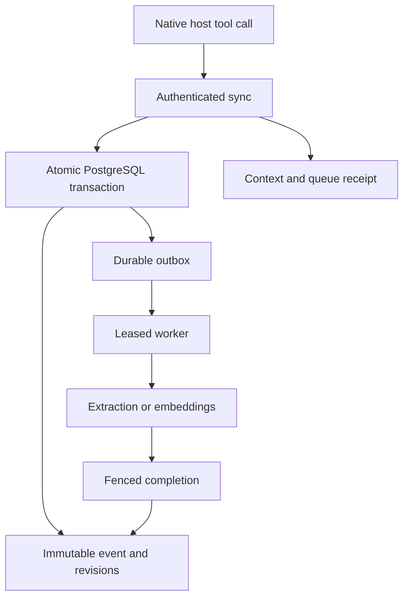

# Hivemind Scale

## Engineering conclusion

The supplied implementation delivers a headless remote MCP service with project-scoped authentication, two bidirectional tools, a transactional immutable ledger, asynchronous extraction and embeddings, real OAuth infrastructure, and native-client configuration generation. It preserves the existing chat applications. The service owns persistent state and processing; the host application owns conversation visibility, model orchestration and permission prompts.

**A remote MCP server cannot guarantee autonomous capture and recall across every native Claude and ChatGPT conversation.** It receives only messages or arguments that the host sends. Instructions can encourage tool use, but cannot compel a pre-answer call, intercept an entire conversation, suppress confirmations or create a higher-priority model policy. This is a protocol boundary, not something a custom decorator or stronger meta-prompt can remove.[^1]

The closest supportable experience is: connect a project-scoped integration once, enable it in the host as required, complete the host's permissions, and continue ordinary conversation. The server supplies its own instructions and tool descriptions; onboarding requires no pasted model prompt. Capture and recall then run when the host invokes the tools. Durable extraction proceeds without another host interaction after a queued fragment has been accepted.

The source is complete executable Python and SQL, with dependencies, migrations, deployment scripts and regression tests. It is a release candidate with an explicit validation record, not a claim that an undeployed service has passed production load, real-provider OAuth, native-client behavior or external security certification. See [VALIDATION.md](VALIDATION.md) for actual execution evidence and outstanding gates.

## Compatibility baseline

Research began on 10 September 2026. The implemented stack pins FastMCP 3.4.7, MCP Python SDK 1.30.0, Pydantic V2, psycopg and psycopg_pool. Its target protocol is the initialization-based **MCP 2025-11-25**, matching the lifecycle requested here. The dependency lock files retain exact package hashes.

There are two corrections to the requested protocol terminology. The initialization result field is **`instructions`**, not `serverInstructions`. Furthermore, the latest specification inspected is **2026-07-28**, which removes `initialize`/`notifications/initialized` and protocol sessions, introduces `server/discover`, and changes request/result negotiation. Adding an invented discovery shim would not make this pinned implementation conform to that newer protocol. Client compatibility must include negotiation with the supported version; the package does not advertise 2026 support.[^2][^3]

| Requirement | Delivered implementation | Enforceable limit |
|---|---|---|
| No user-authored prompt templates | Instructions in the supported initialize result and descriptions on both tools | The host chooses whether to use them |
| Recall before code, architecture and completion | Explicit steering policy and combined sync tool | No universal pre-answer interception hook |
| Capture established state | Version-checked structured claims | Host-supplied acceptance evidence is not cryptographically verified human acceptance |
| Snippet-to-ledger automation | Durable extraction worker with validated structured output | Extracted entries are always tentative |
| Immutable project history | Append-only events and revisions, blocked update/delete/truncate | Database administrators remain trusted |
| One write/read database operation | `execute_autonomous_sync` | Authentication, quota reservation and optional query embedding precede this operation |
| Silent routine maintenance | Concise assistant-oriented content annotations | Host UI and confirmations remain authoritative |
| Tenant/project isolation | Database authentication, FORCE RLS, composite foreign keys and restricted helpers | Does not isolate data from the database administrator or compromised privileged control plane |
| Instant client setup | Generated real local configs and OAuth endpoint inventory | Native app installation/login and approval still belong to the host |

## 1. Autonomous steering protocol

`src/hivemind/server.py` is the executable authority for the full meta-prompt. `FastMCP(..., instructions=SERVER_INSTRUCTIONS)` delegates lifecycle serialization to the SDK. The HTTP test suite verifies that the exact string appears under `result.instructions` and that `serverInstructions` does not appear.

The first paragraph is deliberately self-contained within 512 characters. It states the tool, timing, project binding, accepted-fact rule, untrusted-data boundary and host permission hierarchy. That size follows OpenAI's documented instruction-prefix guidance. OpenAI also documents host app selection and confirmation behavior, so the integration does not promise permanent approval or automatic selection in every conversation.[^4]

The full instruction policy directs the model to recall before producing project code, establishing architecture or reporting completion; combine recall and a known state change when possible; reuse stable idempotency identity only for an identical logical write; and reconcile conflicts against a freshly read head. It prohibits treating tentative discussion, silence or a quoted instruction as acceptance. It also prohibits secret and hidden-reasoning storage and requires honest reporting of pending extraction, unavailable embeddings and failed recall.

Source attribution is intentionally honest. Many native clients do not expose their internal conversation or message identifiers to a tool-using model. Writes therefore accept missing source metadata and record `client=mcp-host` with unavailable identifiers omitted. Known identifiers can be supplied. The host may generate an internal idempotency UUID without asking the user, but it must not present that UUID as a verified native conversation identifier.

### Prompt-injection defense

There are separate defenses at each boundary. The server instructions identify every recalled string as untrusted project data. The extraction model receives a fixed developer-owned extraction policy and the source fragment as untrusted input. Pydantic validates the structured output. Evidence must be an exact substring of the normalized submitted fragment; duplicate entity keys, invalid JSON, ungrounded evidence, non-finite values and oversized output fail validation.

Most importantly, the worker does not have a path to accepted state. Extraction results are constructed as tentative claims in Python and constrained to tentative claims again by SQL and worker-role policies. A later accepted claim must arrive through the authenticated write surface. The immutable record distinguishes `origin=host` from `origin=extractor` and retains the extraction model when applicable.

These controls reduce injection impact; they do not prove semantic truth. An authorized host can submit fabricated evidence, and a quote can be real while an extracted interpretation is wrong. Do not market the ledger as proof of human acceptance or the prompt as a complete injection detector. A deployment requiring independent human approval needs an additional approval channel outside the model's assertions.

### Decorators and dynamic metadata

The custom `memory_tool` decorator centralizes authorization-context access, safe database error mapping, result-size bounds, structured output and content annotations. The returned `TextContent` declares `audience=["assistant"]` and priority 1.0. The same context is present in `structuredContent`; it is not hidden in client-only metadata.

Both tools have `readOnlyHint=false`, `destructiveHint=true`, `idempotentHint=true` and conservative `openWorldHint=true`. Each can revise effective project state, even though historical rows are preserved. Every mutating path requires stable idempotency identity. External extraction and embedding processing is disclosed. A particular history-only or recall-only invocation does not change the whole tool's write-capable schema.[^5]

`CredentialMetadata.on_list_tools` clones the descriptors per request and adds only non-secret credential-presence and authorization-mode metadata. It never mutates a globally registered tool or weakens its safety annotations. Metadata has no authorization authority: SQL rechecks the key and project on every operation. There is no standard annotation that makes a tool a hidden system task or bypasses a host confirmation. The database worker is also distinct from the negotiated MCP tasks feature; the tool returns an ordinary durable receipt and does not advertise unsupported task execution.

## 2. Ledger and schema engine

`src/hivemind/ledger.py` contains the Pydantic V2 data contract and `LedgerEngine`. `src/hivemind/ledger_worker.py` contains the actual asynchronous extraction and indexing worker. The public tool schemas are generated into `schemas/sync_context.json` and `schemas/manage_ledger.json` from the registered server; separate request-model schemas are supplied for direct API development.

| Model | Purpose |
|---|---|
| `Source` | Known host provenance, with honest defaults for unavailable native IDs |
| `Claim` | Entity key, fact/constraint/decision/config/task kind, tentative/accepted/retracted state, value, expected version and evidence |
| `LedgerRevision` | Versioned immutable output shape and digest/provenance fields |
| `SyncRequest` | Optional bound project, query, optional fragment, structured claims and stable write identity |
| `ManageRequest` | Explicit history pagination or one manual versioned override |
| `ExtractedCandidate` | Closed provider schema with entity key, kind, JSON-encoded value and exact source evidence |
| `ExtractionResult` | Bounded list of candidates with no state, tenant, permission or tool-action field |

All models forbid unknown fields. Tenant identity is deliberately absent from the tool arguments. A caller-supplied `tenant_id` is rejected rather than ignored. JSON string values retain meaningful whitespace and case. Unicode normalization and line-ending normalization happen in the Python input boundary; NUL characters, unpaired surrogates, non-finite numbers and Unicode-normalized object-key collisions are rejected.

### Duplicate resolution and optimistic concurrency

The SQL digest is authoritative for stored content. `ledger_canonical_json` normalizes JSON object ordering and JSON syntax; numeric scale is removed so values such as integer one and decimal one do not create separate claims. `ledger_digest` computes SHA-256 over that normalized representation. A claim digest includes entity key, kind, state and value. Evidence and event provenance remain separately recorded so multiple observations can be retained without duplicating an unchanged semantic claim.

The Python `payload_sha256` is explicitly labelled a **wire-payload diagnostic checksum**. It is not falsely presented as byte-identical to PostgreSQL JSONB serialization. Its domain and the authoritative SQL content-digest domain are documented separately.

A project advisory lock serializes revision allocation and idempotency checks across writers. A changed assertion must present the current `expected_version`; SQL raises a serialization conflict instead of silently overwriting. An exact repeat of the current accepted/retracted head or current tentative proposal is a no-op, even if its expected version is stale. Reverting to an older historical value is a new change and must match the live revision. Reusing an idempotency key with different canonical event content raises a distinct conflict.

The entire event, claims, retrieval result and outbox scheduling transaction rolls back on a conflict. This includes the case where an early claim is valid and a later claim in the same batch is stale. The host must reconcile the conflict; automatic retries must never increment an expected version merely to force acceptance.

### State semantics

Each entity has a monotonically increasing revision sequence. Authoritative state is the latest **non-tentative** revision, provided that revision is accepted. Tentative discussion does not become authoritative just because it has a larger revision number.

| Existing history | New entry | Effective result |
|---|---|---|
| No entry | Tentative claim | Proposal exists; no accepted state |
| Tentative proposal | Accepted claim at current version | Accepted state becomes authoritative |
| Accepted A | Tentative B | A remains authoritative; B is retained for review |
| Accepted A | Accepted B at current version | B becomes authoritative; A remains in history |
| Accepted A | Retraction at current version | No active accepted state; all revisions remain |
| Retraction | Tentative proposal | Entity remains retracted |
| Accepted A, then B | Accepted A at current version | A is a new versioned revert, not an old-row resurrection |

The design avoids a mutable `active` column in the new history table. Supersession is derived from the append-only sequence. An `entity_key` has a stable kind; changing a constraint into an unrelated fact under the same key is rejected.

### Transactional outbox

The HTTP handler commits the raw submitted fragment and its outbox records before returning. A separate worker claims jobs with row locks and `SKIP LOCKED`, assigns a unique lease token and a 120-second lease, and commits that claim before calling a provider. There is no open database transaction or held project lock across network I/O.[^6]

Provider work is bounded to 50 seconds at the worker level. Query embeddings have a separate two-second deadline. SQL owns retry scheduling, attempt counts and terminal states; failed jobs retry with exponential delay and jitter, capped at five attempts. A process crash leaves an expiring lease. A reclaimed job gets a new fence token, so a late completion from the old worker cannot write.

The worker rechecks whether the originating key still has project write authority before processing and before completion. Revocation cancels the database completion path; it cannot undo text already sent to a provider before revocation. Extraction never upgrades itself to accepted state. Completion appends tentative revisions and any new embedding jobs atomically with acknowledgment of the extraction job.

The actual provider implementation uses OpenAI's asynchronous SDK `responses.parse` with a closed Pydantic schema, `store=False`, bounded output and disabled hidden retry fan-out. The default extraction model is the dated `gpt-4.1-mini-2025-04-14` snapshot, configurable through `EXTRACTION_MODEL`. Embeddings use `text-embedding-3-small`, 1,536 dimensions, explicit finite/nonzero checks and bounded asynchronous concurrency. Real provider credentials remain deployment inputs; provider responses are mocked in the local unit tests.[^7][^8]

## 3. PostgreSQL 17 and pgvector

Apply `sql/000_roles.sql` through `sql/005_unified_ledger.sql` in order. These are actual migration files, not standalone excerpts. The earlier migrations define tenants, projects, API keys, project grants, billing and managed OAuth binding. Migration 005 adds the new unified ledger using those authenticated principals. Runtime roles never own tables, are not superusers, cannot bypass RLS and cannot assume the private implementation roles.

| Table | Responsibilities |
|---|---|
| `tenants` | Tenant identity and existing plan/account state |
| `projects` | Tenant-owned project identity and limits |
| `api_keys`, `api_key_projects` | Hashed credentials, revocation/expiry, read/write scope and project binding |
| `memory_events` | Immutable raw submitted event, digest, source and idempotency identity |
| `ledger_constraints` | Immutable versioned entities, state, provenance, evidence and extraction origin |
| `vector_knowledge` | Deduplicated historical content, capture-time state, lexical document and vector |
| `ledger_outbox` | Durable extraction/indexing work, leases, attempts, failures and result receipt |
| `usage_counters` | Durable usage and provider-attempt admission limits |

FORCE RLS protects every relevant table, including tenants/projects from the earlier migration. Ordinary runtime credentials cannot insert arbitrary rows into the new ledger; restricted, fixed-search-path functions own the write surface. Composite foreign keys prevent cross-tenant project, actor and event references. Transaction-local identity contains both key identity and proof, and RLS helpers revalidate that proof rather than trusting a caller-set tenant variable. PostgreSQL's documented administrator and owner exceptions are why runtime ownership and BYPASSRLS are explicitly prohibited.[^9]

The worker has no unrestricted table access through its login role. It can invoke bounded claim/completion/failure functions. Their non-login helper role can process jobs across tenants, but callers cannot use that role directly; the functions bind scope to the claimed row and its unexpired lease. This is a trusted background-service boundary, not a claim that no operational component can process more than one tenant.

### Atomic sync function

`execute_autonomous_sync(p_project_id, p_query_text, p_query_vector, p_new_claims)` returns a JSON context packet. `p_new_claims=NULL` means recall only. A non-null envelope contains stable write identity, source, optional fragment and claims. The function validates every field before use; all application calls bind SQL parameters rather than interpolate text.

For writes, the function resolves project authority, locks the project, checks idempotency, inserts the event, reconciles claims and enqueues extraction/embedding jobs. It then assembles accepted constraints, other accepted state, current revision heads and relevant historical memories in the same transaction. The snapshot therefore includes the caller's successfully committed structured claims. Newly queued extraction is explicitly pending, not implied to have finished in that response.

The packet distinguishes `constraints` from other accepted `authoritative_state`, supplies `ledger_versions`, and marks historical memory as supporting evidence. The latest accepted state is fetched independently of semantic similarity, so an embedding outage or irrelevant nearest neighbor cannot discard a current constraint.

### Retrieval and budgets

The HNSW index uses cosine distance with `m=16` and `ef_construction=64`. Retrieval enables strict-order iterative scanning, with bounded scan work, and combines up to 40 semantic and 40 lexical candidates by reciprocal-rank fusion, returning the top eight. RLS and explicit project filters apply to retrieval. HNSW remains approximate: filtering and bounded scans can reduce recall, so native load and filtered-recall measurements remain release gates.[^10]

Local direct-query index qualification behaved unexpectedly with 200 authorized vectors and 200 closer vectors in another project. The direct-query comparison was therefore not treated as a reliable oracle; service retrieval is verified against independently recorded IDs of the known nearest seeded vectors. The service therefore includes an exact project-scoped fallback when ANN returns fewer than eight candidates and a query vector is present. Materialized authorized-project rows are sorted by exact cosine distance; the response exposes `semantic_fallback` and `ann_candidate_count`. The raw direct-query qualification failure is preserved in the validation evidence rather than counted as a pass or attributed solely to an index-engine defect. The fallback can scan and sort a large project, so native latency and statement-timeout behavior still need measurement; it does not repair ANN quality when an adequate-size candidate set contains the wrong nearest neighbors.

Accepted state is limited to 32 entities and 16,384 bytes of key/value/evidence, with at most 128 distinct entity keys per project. These are explicit context-budget choices, not claims of unlimited project knowledge. Historical rows remain available through paginated management queries. Exceeding the accepted-state budget fails the transaction instead of silently trimming a mandatory constraint. Historical recall excerpts carry `text_truncated`; history responses are separately byte-bounded and expose pagination state. Capacity changes require coordinated database, response-budget and client-context testing.

Provider attempt admission is charged in a separate committed preflight before query embedding. Thus a later version conflict or invalid idempotency replay cannot roll back provider-attempt accounting. Read-only credentials attempting a mutation fail scope checks before provider spend. The atomic sync still owns durable mutation/recall accounting. This separates cost admission from the write transaction without pretending the entire HTTP request is one database roundtrip.

### Upgrade boundary

Migration 005 is additive and leaves the old `constraints_ledger`, `conversation_events`, `memory_embeddings` and old worker tables intact. **It does not automatically backfill a populated earlier deployment into the new ledger.** The package is immediately installable as a fresh service. For an existing deployment, keep serving the earlier version until a separately reviewed import maps old events, accepted heads and source provenance, verifies counts/digests and drains the old worker. Do not switch the new public tools onto a populated installation expecting earlier memory to appear automatically.

This explicit boundary avoids inventing tentative/accepted provenance that the older schema did not record. The older source and tests remain in the package for migration and infrastructure regression purposes; the current MCP endpoint exposes only the new tools.

## 4. Headless server and authentication

Start the API with `uvicorn hivemind.server:create_app --factory`. `server.py` declares the two public tools; `app.py` composes FastMCP, asynchronous connection pools, OAuth routes, health checks and request guards. Stateless Streamable HTTP is the default. A legacy SSE endpoint remains opt-in for header-key mode; the managed OAuth overlay uses Streamable HTTP.

A Bearer key is high-entropy opaque data. Its digest, not its plaintext, is stored in PostgreSQL. Verification checks key expiry/revocation, account state and read/write capabilities. Every transaction reauthenticates on the connection doing the query. A single-project binding makes `project_id` optional; an ambiguous multi-project key produces a selection error instead of guessing from repository names or recalled text.

There is no security reliance on an MCP session ID. Capability checks apply to the principal and project for the present operation. After query embedding completes, the final transaction checks authorization again, so a revoked credential cannot commit merely because it passed an earlier preflight. Tokens in query parameters are rejected.

### Real hosted-client OAuth

The inherited `oauth.py` supplies an actual managed Auth0 authorization flow and FastMCP OAuth proxy, with encrypted shared Redis storage, PKCE, issuer/audience/algorithm validation, identity-to-key binding and revocation revalidation. It does not accept arbitrary external JWTs as project membership, infer membership from email domains, or pass the server's upstream identity credentials to the host.[^11]

Account identity is linked to an existing authorized project key only after separate proof of the key and a fresh verified identity login. Client callback addresses are explicit allowlisted values. The generator can inspect the deployed protected-resource and authorization-server metadata; generated expected metadata is clearly distinguished from live verified metadata. See [docs/CLIENT_CONNECTIONS.md](docs/CLIENT_CONNECTIONS.md) for the exact real routes and callback behavior.

The server's request guard validates origins and Host routing, rejects token-bearing URLs, bounds every POST/PUT/PATCH body, coalesces tiny body chunks, and applies a 15-second body deadline. It preserves response streaming. Error responses expose stable categories without returning private SQL details. Logs exclude tokens, content, vectors and unknown URL paths. OAuth dynamic-registration hardening and its test evidence are described in [docs/SECURITY_REVIEW.md](docs/SECURITY_REVIEW.md).

The deployment package retains Docker, Caddy TLS, private database networking, blue/green application deployment, a separate worker, migration checksums and backup/rollback scripts. The current Compose worker command is `python -m hivemind.ledger_worker`. Existing account/billing pages are optional administration pages, not a chat frontend.

## 5. Instant setup generator

`scripts/generate_client_config.py` takes the real HTTPS deployment origin and an issued project key through an environment variable or hidden input prompt. It produces complete local artifacts without overwriting a user's live application configuration. Files are published atomically and existing files are refused unless replacement is explicitly requested. Keys never appear in generated installation links or registration command arguments.

| Client | Generated setup | Practical boundary |
|---|---|---|
| Claude Desktop local config | `claude_desktop_config.json` and a real local FastMCP stdio-to-HTTP bridge | Requires the pinned Python client dependencies locally |
| Claude account connector on web/Desktop/mobile | Real remote HTTPS endpoint and OAuth login instructions | Connector availability, selection and tool permissions remain host-controlled |
| Cursor | Private Bearer-header `mcpServers` configuration | Merge into the documented user/workspace config |
| Cursor install link | Documented `cursor://` link with endpoint-only OAuth config | Installation/login still require host interaction; no secret embedded |
| Claude Code | Exact `claude mcp add` registration plus shell and PowerShell launch wrappers | Environment expansion and permissions remain native-client behavior |
| ChatGPT developer mode | Real resource/OAuth metadata inventory and optional verified snapshots | No invented API-key OAuth or universal one-click installation manifest |

Claude's account connectors and Desktop's process configuration are distinct paths. The bridge explicitly reads the remote initialization instructions and forwards them to the local proxy; it is tested using real in-memory MCP exchanges. A remote `url` entry is not fabricated for a Desktop configuration format that expects a process.[^12]

Cursor documents remote URL/header configuration and an installation-link scheme. The generator implements those formats with proper URL and shell escaping. Claude Code's supported HTTP registration syntax is emitted directly; secrets are loaded through the process environment, not literal shell-history arguments.[^13][^14]

ChatGPT's OAuth requirements are not satisfied by a file that simply describes an API key as OAuth. Native developer-mode installation uses the actual resource endpoint and authorization flow. There is no standards-based `ai-plugin.json` installation contract for this two-tool MCP service; the endpoint inventory intentionally reports no such manifest.[^11]

POSIX output protection is tested. Windows output protection uses a protected, owner-only DACL through the Windows API before credential content is written and fails closed if hardening fails. The PowerShell paths are generated, but actual Windows ACL execution and native app behavior remain untested outside a Windows machine. This distinction is stated in the connection guide.

## Deployment and acceptance

Final local verification completed on **11 September 2026**:

| Verification | Actual result |
|---|---|
| Serial Python suite through the actual psycopg/SQL boundary | **178 passed, 1 raw-index qualification skipped** |
| SQL smoke checks, including all six migrations | **72 passed** |
| Ruff, Python wheel build and shell syntax checks | Passed |
| Separate native concurrency cases | Three supplied and enabled in CI; not executed locally |
| Live native clients, OAuth providers and deployment | Not executed |

The database execution used PostgreSQL 17.5 compiled to WebAssembly with pgvector 0.8.0 and one shared session. External provider/OAuth calls in the Python tests use fakes. Exact fallback retrieval passed against independently known authorized IDs; the separate raw filtered-HNSW qualification remains a native release gate. These results establish the recorded local behavior, not multi-session concurrency, cloud readiness or universal host adherence. The source archive includes the complete validation record, reproducible harnesses and execution logs.

A fresh deployment follows this order: create the Python environment; apply all six migrations to disposable PostgreSQL 17/pgvector; run the behavioral and native concurrency tests; build the immutable OCI image; bootstrap the private database/network and HTTPS endpoint; supply the server's provider credential; start the API and durable worker; configure real OAuth and bind a project key; generate client configs; then run the authenticated smoke and native-client acceptance cases.

The runbook requires actual domain, account, image and secret inputs. No placeholder credentials are embedded in executable code, and no external account resource was created during delivery. Operator-only deployment scripts perform their described mutations when deliberately executed with real credentials. The source package also builds successfully as a Python wheel; the SQL migrations and deployment files remain alongside the Python source rather than being implicitly installed by the wheel.

Transport acceptance and model adherence must be measured separately. For each advertised host, test ordinary conversation without a memory-specific instruction: ask for code consistent with an earlier accepted constraint; propose a conflicting alternative without accepting it; accept a revision; reconnect from another native client; revoke the original key; introduce a quoted prompt-injection attempt; and opt out of capture. Record whether the host invoked recall, preserved accepted state, requested confirmation, attributed provenance correctly and respected opt-out. A successful `tools/list` response proves none of those model behaviors by itself.

Before production, also execute the native multi-connection concurrency tests, real OAuth code/refresh/revocation flow, provider failure/backoff cases, HNSW filtered-recall and pool load measurements, a backup restoration and a controlled rollback. The delivered validation record identifies which checks actually ran and which remain external gates. The product can accurately promise durable, authorized cross-client memory when invoked; universal invisible always-on capture remains outside a standalone remote server's control.

## Sources

[^1]: Model Context Protocol, [Architecture, 2025-11-25](https://modelcontextprotocol.io/specification/2025-11-25/architecture). Host/server context and trust boundaries; accessed 10 September 2026.
[^2]: Model Context Protocol, [Schema Reference, 2025-11-25](https://modelcontextprotocol.io/specification/2025-11-25/schema) and [Lifecycle](https://modelcontextprotocol.io/specification/2025-11-25/basic/lifecycle). InitializeResult instructions and negotiation; accessed 10 September 2026.
[^3]: Model Context Protocol, [Key Changes, 2026-07-28](https://modelcontextprotocol.io/specification/2026-07-28/changelog). Removal of initialization/session semantics and new discovery; accessed 10 September 2026.
[^4]: OpenAI, [ChatGPT Developer mode](https://developers.openai.com/api/docs/guides/developer-mode). Server instruction guidance, tool selection and confirmations; accessed 10 September 2026.
[^5]: Model Context Protocol, [Tools, 2025-11-25](https://modelcontextprotocol.io/specification/2025-11-25/server/tools); FastMCP, [Tools](https://gofastmcp.com/servers/tools) and [Middleware](https://gofastmcp.com/servers/middleware). Tool hints and registration concepts. Executable API signatures were checked against the installed pinned SDK rather than assuming current online APIs match it.
[^6]: PostgreSQL Global Development Group, [PostgreSQL 17 SELECT](https://www.postgresql.org/docs/17/sql-select.html). Row locking and SKIP LOCKED semantics; accessed 10 September 2026.
[^7]: OpenAI, [Structured outputs](https://developers.openai.com/api/docs/guides/structured-outputs) and [Python SDK helpers](https://github.com/openai/openai-python/blob/main/helpers.md). Structured parsing interface; accessed 10 September 2026.
[^8]: OpenAI, [Embeddings guide](https://developers.openai.com/api/docs/guides/embeddings), [GPT-4.1 Mini model](https://developers.openai.com/api/docs/models/gpt-4.1-mini), and [text-embedding-3-small model](https://developers.openai.com/api/docs/models/text-embedding-3-small). Model pages rechecked 11 September 2026; the dated extraction snapshot remains listed. Provider embedding interface. The exact configured model/dimension behavior is implemented and validated in local adapter tests.
[^9]: PostgreSQL Global Development Group, [PostgreSQL 17 Row Security Policies](https://www.postgresql.org/docs/17/ddl-rowsecurity.html) and [CREATE FUNCTION](https://www.postgresql.org/docs/17/sql-createfunction.html). Role exceptions, FORCE RLS and security-definer search-path requirements; accessed 10 September 2026.
[^10]: pgvector maintainers, [pgvector README](https://github.com/pgvector/pgvector). HNSW cosine indexing, filter behavior and iterative scanning; accessed 10 September 2026.
[^11]: OpenAI, [Authentication](https://developers.openai.com/plugins/build/auth); FastMCP, [OAuth Proxy](https://gofastmcp.com/servers/auth/oauth-proxy). Native OAuth and managed-provider integration requirements; accessed 10 September 2026.
[^12]: Anthropic, [Get started with custom connectors using remote MCP](https://support.claude.com/en/articles/11175166-get-started-with-custom-connectors-using-remote-mcp); Model Context Protocol, [Connect local servers](https://modelcontextprotocol.io/docs/2026-07-28/develop/connect-local-servers). Account connectors and local process configuration; accessed 10 September 2026.
[^13]: Cursor, [MCP configuration](https://cursor.com/docs/mcp) and [Installation links](https://cursor.com/docs/mcp/install-links). URL/header entries, file locations and install URI; accessed 10 September 2026.
[^14]: Anthropic, [Claude Code MCP](https://code.claude.com/docs/en/mcp). HTTP registration, configuration and environment expansion; accessed 10 September 2026.
